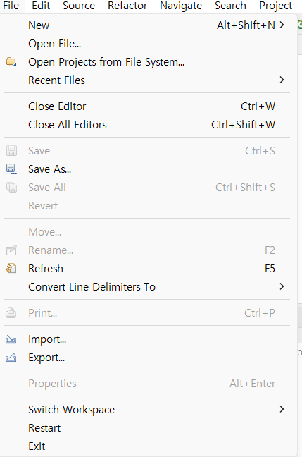
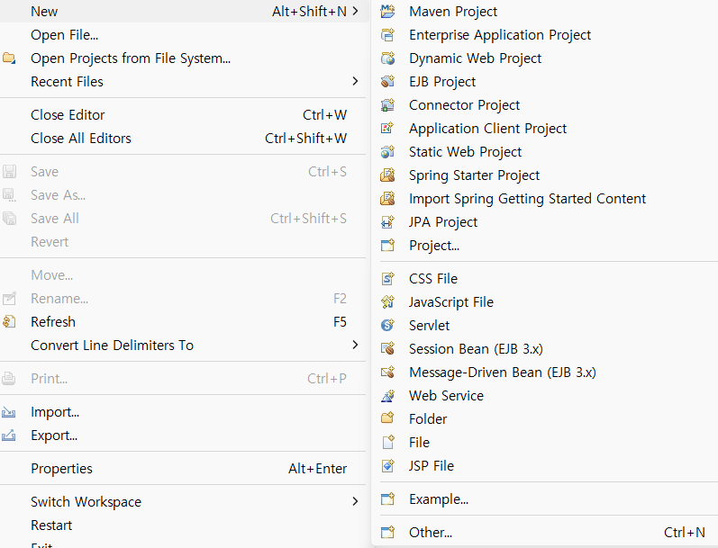

```
이 글은 개인적인 학습을 위해 작성되었으며, 상업적 목적이 없습니다.
```

 출처 : 
 1. https://carrotweb.tistory.com/19
 2. chat gpt 
 3. https://min9yu98.tistory.com/7

# File 메뉴 



## New 


1. Java 요소 또는 새 리소스를 생성 
2. Java 관점에서는 기본적으로 프로젝트, 패키지, 클래스 등을 만들기 위한 작업을 사용 가능 

### 00. Maven Project
Maven을 사용해 의존성 관리 및 빌드 자동화를 수행하는 프로젝트 

1. Maven은 소프트웨어 프로젝트 관리 도구, 프로젝트 객체 모델 (POM, Project Object Model)의 개념을 기반으로 프로젝트 관리에 필요한 환경 설정과 라이브러리에 대한 의존성 관리 
2. 이러한 프로젝트 객체 모델 (POM)의 정보는 프로젝트의 `pom.xml` 파일에 존재  
3. Maven은 기본적인 로컬 저장소로 "C:\Users\{사용자계정}\.m2\repository"에 메이븐 아티팩트(Maven artifact)들이 저장되도록 구성합니다. (윈도우10 기준)
4. Maven은 프로젝트 빌드 시 플러그인(Plugin)을 사용 

4. Help > About Eclipse IDE 클릭할 경우 Maven 버전 확인 가능 (이클립스 IDE는 Maven을 내장된 플러그인 형태로 제공)
    

5. Create Maven Project 할 경우 상황에 따른 설정 ->  Artifact 정보 기입 -> finish 

6. 생성된 Maven Project의 pom.xml을 적절히 변경

7. properties에서 encoding 관련 설정들, Java Build Path 등등 필요한 설정 변경 


```
✅ 내 맘대로 정리하기

🔥 pom.xml 
- 프로젝트 객체 모델 정보에 대해 기술 

🔥 .m2
- Maven의 기본 로컬 저장소(Local Repository)가 위치하는 디렉터리 

🔥 메이븐 아티팩트 
- 프로젝트에 필요한 파일 or 프로젝트 빌드 결과물 
- Maven은 이런 아티팩트를 중앙 저장소나 로컬 저장소에서 가져오고 관리 

-로컬 저장소에 없는 경우:
중앙 저장소에서 라이브러리를 가져와 로컬 저장소에 저장.
-로컬 저장소에 있는 경우:
로컬 저장소에서 바로 가져와 네트워크를 사용하지 않으므로 속도가 더 빠름.


🔥 artifact 정보 
- 라이브러리나 프로젝트를 고유하게 식별하기 위한 메타 데이터 (ex Group ID, Artifact ID 등)
- maven에서 artifact 정보 처음 도입 및 표준화
- gradle, spring 등에서도 이 설정을 이용해서 프로젝트 생성하곤 함 
```


---

### Artipact 정보
- **Group Id**
1. 프로젝트 또는 라이브러리를 식별하는 고유한 네임스페이스, 다른 그룹과구분되어야 함 
2. 일반적으로 회사 이름 , 조직 이름, 도메인 주소를 역순으로 사용. 그 뒤에 프로젝트 이름 or 모듈 이름을 추가하여 구분
   

- **Artifact Id** 
1. 제품명(산출물명) , 프로젝트 명 
2. 소문자로 작성. '-' or '.' 포함하여 구분하기도 함 
3. packaging 이 jar일 경우 jar 파일의 파일명이 됨 
4. jar 파일명 구조는 {artifact id}-{version}.jar 이다. 
    
- **Version** 
1. artifact의 버전 
2. 개발 버전은 SNAPSHOT, 배포 버전은 RELEASE로 사용 
3. 생략 가능 
  
- **Packaging**
   
    
1. 프로젝트의 패키징 방식 
2. jar (Java Archive)는 여러 개의 자바 클래스나 리소스, 메타 데이터 등을 하나의 파일로 압축 
3. pom (project object model)은 
보통 부모 프로젝트를 만들 때 pom을 이용
4. jar, war 을 이용하여 실제 실행 가능한 아티팩트를 생성하면 pom은 실행 파일을 만들지는 않고 다른 프로젝트 간의 의존성 관리나 모듈화된 프로젝트 구조에서 모듈을 묶는 역할을 담당
5. 즉, pom은 단독으로 실행 가능한 아티팩트를 만드는 것이 아니라 구성 관리와 의존성 관리를 위해 사용되는 특별한 패키징 타입 

6. war (Web Application ARchive)는 자바 클래스, 서버 페이지(jsp), XML, HTML, 스크립트 등 웹 프로젝트의 모든 파일을 하나의 파일로 압축 
   
- **Name**  
Artifact name 
   
- **Description**  
Artifact 설명 
 
---

### jar vs war 
- war (Web Application Archive)
1. 웹 애플리케이션 압축 파일 포맷 
(jar 파일의 일종, 웹 애플리케이션에 특화된 패키징 방식)
2. 웹 관련 자원 포함 (JSP, Servlet, HTML, JavaScript 등)
3. 내부 구조가 웹 서버(Tomcat 등)에서 인식할 수 있도록 구성
(WEB-INF/web.xml, WEB-INF/classes, WEB-INF/lib 등 포함)
4. 단독 실행 불가능, 별도의 웹 서버 or 웹 컨테이너가 필요 


- jar (Java ARchive)
1. Java 애플리케이션이 동작할 수 있도록 자바 프로젝트를 압축한 파일 
2. Java 클래스 파일, Java 리소스 파일, 라이브러리 파일 등 포함 
3. jar 파일은 별도의 서버 필요 없이, JVM 위에서 실행   
`java -jar 프로젝트명.jar`
4. 실행 가능한 JAR 파일은 META-INF/MANIFEST.MF 파일에 주 클래스를 명시해야 함


- 배포 방식 (예시)
  - war (spring)
    1. 실행 환경을 제공하는 서버에 Tomcat 설치
    2. Spring 프레임워크에서 만든 프로젝트를 WAR 파일로 빌드
    3. 빌드된 WAR 파일을 Tomcat의 webapps 디렉토리에 배포 

  - jar (spring boot)
    1. Spring Boot 프레임워크에서 만든 프로젝트를 JAR 파일로 빌드
    2. 실행 환경을 제공하는 서버에 JAR 파일 배포
    3. JAR 파일 내부에 포함된 내장 톰캣을 통해 애플리케이션 실행
    

```
✅ 내 맘대로 정리하기

- 아카이브 
1. 단순히 여러 개의 파일을 하나로 묶은 파일을 의미.
2. 보통 .zip, .tar, .jar, .war 같은 확장자로 생성


- Java 애플리케이션
1.  독립 실행형 자바 프로그램으로, JAR (Java ARchive) 파일 형식으로 패키징되어 로컬 환경에서 실행

- 웹 애플리케이션 
1.  웹 브라우저를 통해 서버에서 실행되는 애플리케이션
2. 주로 웹 서버(예: Apache, Tomcat 등)에서 실행되며, 웹 브라우저를 통해 접근하여 사용자와 상호작용을 합니다
```